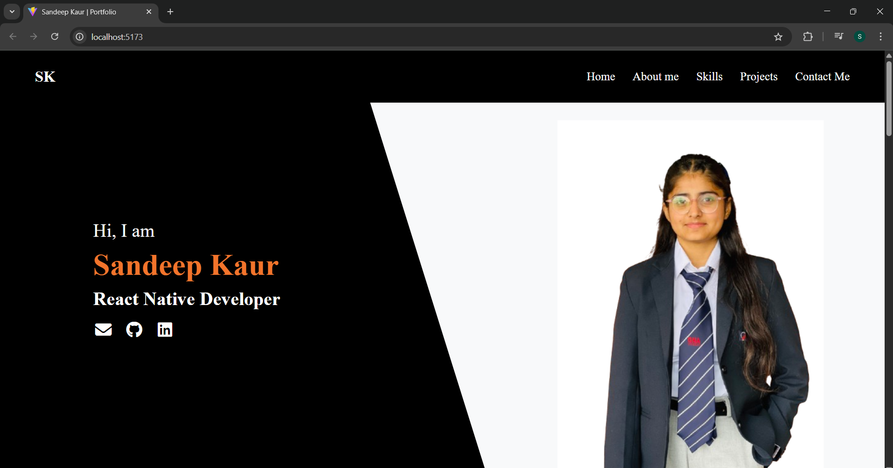
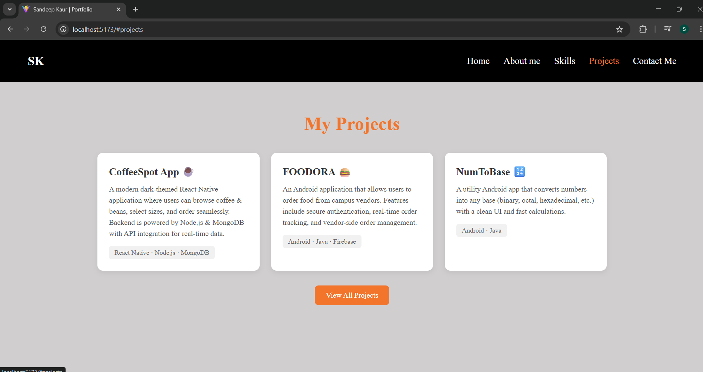

# 🌐 My Portfolio Website

This is my personal portfolio website built with **React.js**.  
It showcases my projects, skills, and contact information.

## 🚀 Features
- Modern and responsive design
- About Me section
- Projects showcase
- Contact form with EmailJS integration
- Smooth navigation and animations

## 🛠️ Tech Stack
- React.js
- CSS3
- JavaScript
- EmailJS (for contact form)

## 📂 Project Structure
MyPortfolio/
├── public/
├── src/
│ ├── assets/ # Images and icons
│ ├── components/ # Reusable components
│ ├── screens/ # Page sections
│ ├── styles/ # CSS files
│ └── App.js
├── package.json
└── README.md

## 📸 Portfolio Screenshots

### 🏠 Home Page

### 💼 Projects

